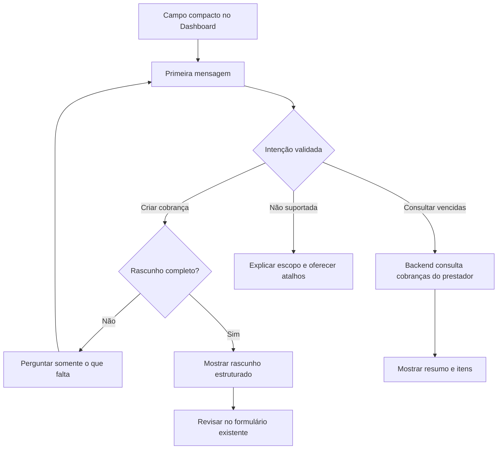

# ADR-008 — Assistente conversacional híbrido

## Decisão

Evoluir o comando isolado do Dashboard para um assistente conversacional
híbrido. Antes da primeira mensagem, a interface continua compacta como o campo
atual. Depois do envio, o mesmo componente se expande para uma conversa curta,
com respostas estruturadas e ações visíveis.

O assistente não será um chat genérico. Cada entrega habilitará um conjunto
explícito de intenções. A próxima versão suportará:

1. criar uma cobrança em uma ou mais mensagens;
2. consultar cobranças vencidas.

O modelo interpreta a intenção e extrai argumentos, mas não consulta o banco,
não executa ações financeiras e não redige resultados com base em dados
financeiros. O backend autenticado valida os argumentos, consulta os dados do
prestador e monta respostas determinísticas.

O usuário continuará revisando a cobrança no formulário existente antes de
criá-la. Consultas serão somente leitura.

## Contexto

O primeiro MVP do assistente usa `gpt-5.4-nano` para transformar uma única
frase em um rascunho de cobrança. A agenda de clientes é resolvida no backend e
não é enviada ao modelo. Quando faltam campos, o assistente informa o que falta,
mas a mensagem seguinte não preserva o rascunho anterior. Também não existem
intenções de consulta.

Essa experiência valida a extração inicial com baixo custo, porém cria dois
problemas de uso:

- o usuário precisa repetir todo o pedido quando esquece uma informação;
- a aparência de assistente gera a expectativa legítima de comandos como
  “Quais cobranças venceram?”, que hoje não são suportados.

Abrir uma tela de chat irrestrita aumentaria essa expectativa sem que o produto
fosse capaz de atendê-la. A interface híbrida mantém o primeiro contato simples
e revela a conversa apenas quando ela é útil.

## Objetivos

- permitir completar uma cobrança em mensagens sucessivas;
- responder “Quais cobranças venceram?” e variações equivalentes;
- deixar claro o que o assistente sabe fazer;
- preservar a revisão humana antes da criação;
- manter o custo e a latência adequados ao piloto;
- não aumentar a exposição de dados financeiros à OpenAI;
- permitir novas intenções sem redesenhar novamente a interface.

## Fora do escopo desta etapa

- chat genérico ou respostas de conhecimento geral;
- histórico permanente ou memória entre sessões;
- áudio;
- entrada ou resposta pelo WhatsApp;
- envio automático de mensagens ao cliente;
- alteração de cobranças ou pagamentos pelo chat;
- marcar pagamento, cancelar ou excluir sem o protocolo de confirmação;
- consultas financeiras abertas além de cobranças vencidas;
- geração de respostas livres a partir da agenda ou do histórico financeiro.

## Experiência de uso

### Estado inicial

O Dashboard mostra um único campo com o título “Assistente Prestou”, texto curto
de escopo e sugestões acionáveis:

- `Criar cobrança`
- `Quem está me devendo?`

O placeholder pode continuar exemplificando uma cobrança completa. O botão deve
usar um verbo neutro, como “Enviar”, porque nem toda mensagem preparará uma
cobrança.

### Depois da primeira mensagem

O card se expande no próprio Dashboard e passa a mostrar a troca atual. O campo
de texto permanece no final. Não é necessário criar uma página de chat nesta
etapa.

```text
Você
Cobra o João pela lavagem

Prestou
Qual foi o valor e quando vence?

Você
R$ 80, amanhã

Prestou
João · Lavagem · R$ 80,00 · vence amanhã
[Revisar cobrança]
```

O assistente deve perguntar somente pelos campos ainda ausentes. Quando o
rascunho estiver completo, a resposta usa um card estruturado e uma ação
“Revisar cobrança”, que abre o formulário já preenchido. A cobrança não é criada
diretamente na conversa.

Para consultas, a resposta deve ser composta pelos dados retornados pelo
backend:

```text
Prestou
Você tem 3 cobranças vencidas, somando R$ 450,00.

João · R$ 80,00 · venceu em 20/07
Maria · R$ 150,00 · venceu em 18/07
Carlos · R$ 220,00 · venceu em 15/07

[Ver todas as atrasadas]
```

Em telas pequenas, a conversa cresce verticalmente e os controles quebram para
uma coluna. Resultados devem manter nome, valor e vencimento legíveis, sem
simular bolhas decorativas para cada dado.

### Limites visíveis

Uma resposta não suportada deve informar o limite e oferecer as duas ações
disponíveis, sem inventar uma resposta:

> Por enquanto, posso preparar uma cobrança ou mostrar as cobranças vencidas.

Estados de carregamento, erro e repetição devem permanecer no componente. Uma
falha do modelo não pode esconder os filtros normais do Dashboard.

## Fluxo



## Arquitetura proposta

### Contrato estruturado

Substituir a semântica de “interpretar uma cobrança” por “enviar uma mensagem
ao assistente”. A resposta deve ser uma união discriminada, sem depender de
texto livre do modelo:

```ts
type AssistantResponse =
  | { kind: "clarification"; message: string; state: ChargeDraftState }
  | { kind: "charge_draft"; message: string; draft: ChargeDraft }
  | { kind: "overdue_charges"; summary: OverdueSummary; items: ChargeItem[] }
  | { kind: "unsupported"; message: string; suggestions: string[] };
```

Os nomes definitivos podem mudar na implementação, mas os estados devem
continuar explícitos e validados com Zod no backend.

### Intenções e ferramentas

A chamada à Responses API deve continuar com ferramentas estritas e
`tool_choice` obrigatório. O conjunto inicial será equivalente a:

- `preparar_cobranca`: extrai cliente, serviço, valor e vencimento;
- `listar_cobrancas_atrasadas`: identifica uma consulta somente de leitura;
- `pedido_nao_suportado`: impede que o modelo improvise outra capacidade.

Para criação em várias mensagens, o frontend mantém o estado parcial durante a
sessão e o devolve em cada pedido. O backend valida esse estado antes de
combiná-lo com a nova extração. Isso evita banco e migration no MVP. O estado é
sempre tratado como entrada não confiável e não autoriza nenhuma ação.

O modelo recebe somente a nova mensagem e os campos parciais necessários para
completar o rascunho. Não precisa receber toda a conversa. A interface pode
manter as mensagens localmente para apresentação.

### Resolução e consultas

- A agenda completa nunca é enviada à OpenAI.
- Cliente e ambiguidades de nomes continuam resolvidos deterministicamente no
  backend, dentro do prestador autenticado.
- A intenção de listar vencidas não recebe registros financeiros no modelo.
- Depois de identificar a intenção, o backend consulta somente pagamentos do
  prestador autenticado com estado persistido `em_aberto` e vencimento anterior
  à data atual em `America/Sao_Paulo`.
- O total, a formatação e a mensagem de lista vazia são calculados pelo backend.
- A lista inicial deve ser limitada; “Ver todas as atrasadas” aplica o filtro
  existente no Dashboard.

### Sessão e memória

O MVP terá memória apenas enquanto o componente estiver montado. Atualizar a
página ou sair da conta encerra a conversa. Não haverá `conversation_id`, tabela
de mensagens nem armazenamento de texto livre.

Se a pesquisa com usuários demonstrar necessidade de retomar conversas, uma
nova decisão deverá definir retenção, exclusão, auditoria e base legal antes de
persistir mensagens.

## Segurança, privacidade e confiabilidade

- Manter `store: false` na Responses API.
- Manter timeout e `safety_identifier` pseudonimizado.
- Não enviar lista de clientes, cobranças ou valores do banco ao modelo.
- Validar toda saída do modelo e todo estado devolvido pelo navegador.
- Não executar escrita a partir de texto do chat.
- Exigir o formulário de revisão para criar a cobrança.
- Aplicar o protocolo de proposta e confirmação a qualquer ação financeira
  futura de alto risco.
- Limitar tamanho da mensagem, quantidade de turnos visíveis e frequência por
  usuário.
- Não registrar o conteúdo integral das mensagens em analytics ou logs de
  aplicação; registrar apenas intenção, resultado, latência e erros técnicos.
- Respostas de consulta devem respeitar o `provider_id` obtido da sessão
  validada, nunca um identificador fornecido pelo modelo ou navegador.

## Plano de implementação

### Fase 1 — Componente conversacional e criação em vários turnos

1. Renomear o componente visual para “Assistente Prestou” e trocar o CTA por
   “Enviar”.
2. Adicionar estado de mensagens, estado parcial do rascunho e sugestões
   iniciais no frontend.
3. Expandir o card após a primeira mensagem, mantendo o composer no final.
4. Evoluir o contrato da API para receber a mensagem atual e um rascunho parcial
   validado.
5. Combinar apenas campos válidos, preservando os já informados e permitindo
   correção explícita pelo usuário.
6. Mostrar perguntas de esclarecimento e o card de rascunho como componentes
   estruturados.
7. Reutilizar a navegação atual para o formulário preenchido.
8. Cobrir extração parcial, continuação, correção, ambiguidade de cliente,
   expiração da sessão visual e erros da OpenAI com testes.

### Fase 2 — Consulta de cobranças vencidas

1. Adicionar a intenção estrita de consulta de atrasadas.
2. Reutilizar a regra existente de estado derivado `atrasada`.
3. Criar um serviço de consulta limitado ao prestador autenticado, com total e
   paginação ou limite inicial.
4. Retornar dados estruturados diretamente ao frontend, sem reenviá-los ao
   modelo.
5. Renderizar resumo, primeiros itens, estado vazio e ação para aplicar o filtro
   “Atrasada” no Dashboard.
6. Testar isolamento entre prestadores, datas no fuso de São Paulo, lista vazia,
   limite de resultados e falha do modelo.

### Fase 3 — Piloto e decisão de expansão

1. Validar de 20 a 50 frases reais de criação e consulta.
2. Medir onde o usuário corrige dados ou abandona a conversa.
3. Ajustar instruções, exemplos e mensagens sem ampliar intenções durante o
   piloto.
4. Decidir separadamente se entram consultas como “Quanto tenho a receber?” e
   busca por cliente.
5. Manter ações de pagamento fora do chat até validar o protocolo de confirmação
   nessa nova interface.

## Critérios de aceite do próximo MVP

- “Cobra o João pela lavagem” gera uma pergunta apenas sobre os campos ausentes.
- “R$ 80, amanhã” completa o rascunho sem exigir a repetição da primeira frase.
- O usuário consegue corrigir um campo antes de abrir o formulário.
- O rascunho nunca cria uma cobrança sem revisão e confirmação no formulário.
- “Quais cobranças venceram?” retorna contagem, total e itens pertencentes apenas
  ao prestador autenticado.
- Não havendo atrasadas, a resposta informa isso sem produzir registros
  fictícios.
- Uma intenção não suportada explica o escopo atual e apresenta atalhos úteis.
- Nenhum cadastro de cliente ou resultado financeiro é incluído na requisição à
  OpenAI.
- O fluxo funciona com `WHATSAPP_MODE=log` e sem envio pelo WhatsApp.
- Testes unitários, typecheck e build continuam passando.

## Métricas do piloto

- percentual de conversas que chegam ao rascunho;
- quantidade mediana de mensagens até o rascunho;
- percentual de rascunhos corrigidos no formulário;
- tempo entre a primeira mensagem e a criação confirmada;
- sucesso das consultas de vencidas;
- intenções não suportadas mais frequentes;
- latência, timeout e taxa de erro por intenção;
- custo médio de tokens por conversa.

As métricas não devem armazenar o texto completo das mensagens nem dados
identificáveis de clientes.

## Alternativas consideradas

### Manter apenas o comando de uma frase

Tem menor complexidade, mas força repetição quando há dados ausentes e não
acompanha a expectativa criada pela interface de assistente.

### Criar agora uma página de chat genérico

Oferece mais espaço, porém sugere capacidades que o produto ainda não possui,
aumenta o risco de respostas improvisadas e amplia prematuramente memória,
privacidade e custo.

### Enviar os dados financeiros ao modelo para ele responder

Facilitaria respostas em linguagem livre, mas é desnecessário para consultas
estruturadas, aumenta exposição de dados e torna os resultados menos
determinísticos.

### Persistir toda a conversa

Permitiria retomada posterior, porém exige migration, política de retenção,
tratamento de solicitações de exclusão e controles adicionais. Não é necessário
para validar o fluxo.

## Consequências

- O componente deixa de ser específico de criação e passa a representar um
  conjunto explícito de capacidades.
- A primeira interação continua rápida e ocupa pouco espaço no Dashboard.
- Criação e consulta compartilham a mesma entrada sem compartilhar regras de
  execução.
- O backend ganha um orquestrador de intenções e respostas estruturadas.
- O frontend passa a administrar estado conversacional efêmero.
- O consumo de tokens cresce em conversas com esclarecimentos, mas permanece
  limitado porque não é necessário reenviar histórico completo ou dados do
  banco.
- Novas intenções exigirão contrato, autorização, resposta e critérios de
  aceite próprios; não serão liberadas somente por alteração de prompt.

## Questões para depois do piloto

- O assistente deve continuar no Dashboard ou ganhar uma página dedicada?
- Quantos resultados vencidos devem aparecer antes de “Ver todas”?
- Vale persistir conversas ou basta preservar o rascunho durante a navegação?
- Qual consulta de leitura gera mais valor depois de atrasadas: total a receber,
  busca por cliente ou cobranças a vencer?
- Em que momento áudio reduz atrito o suficiente para justificar custo e
  tratamento adicional de dados?
