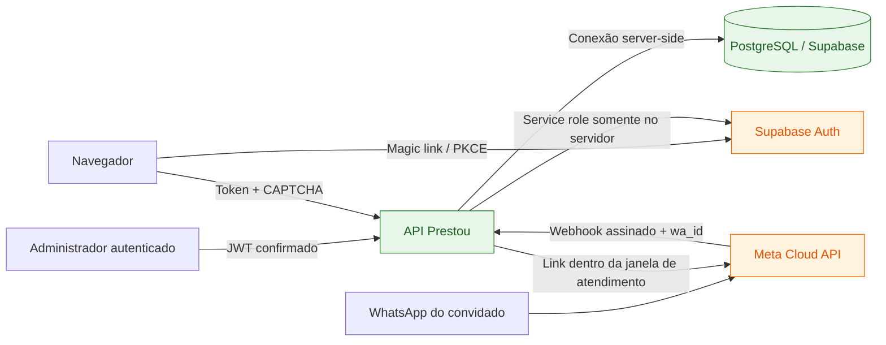
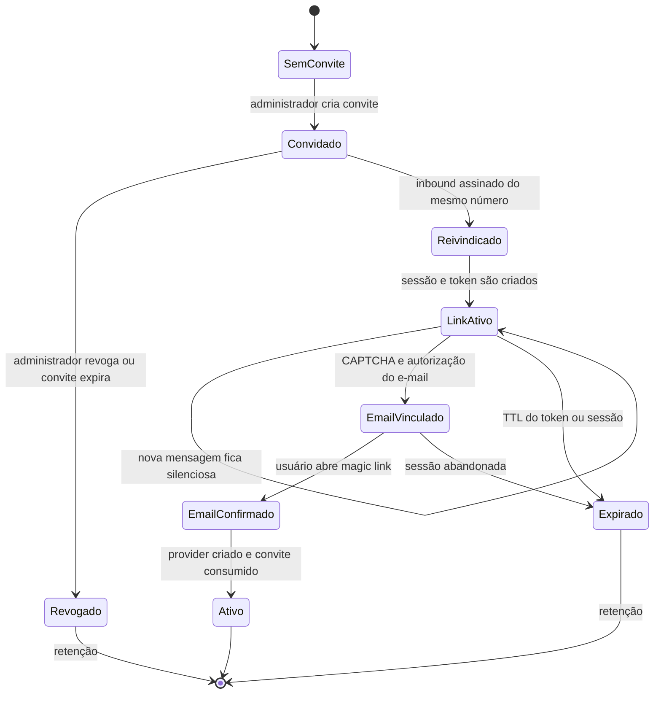
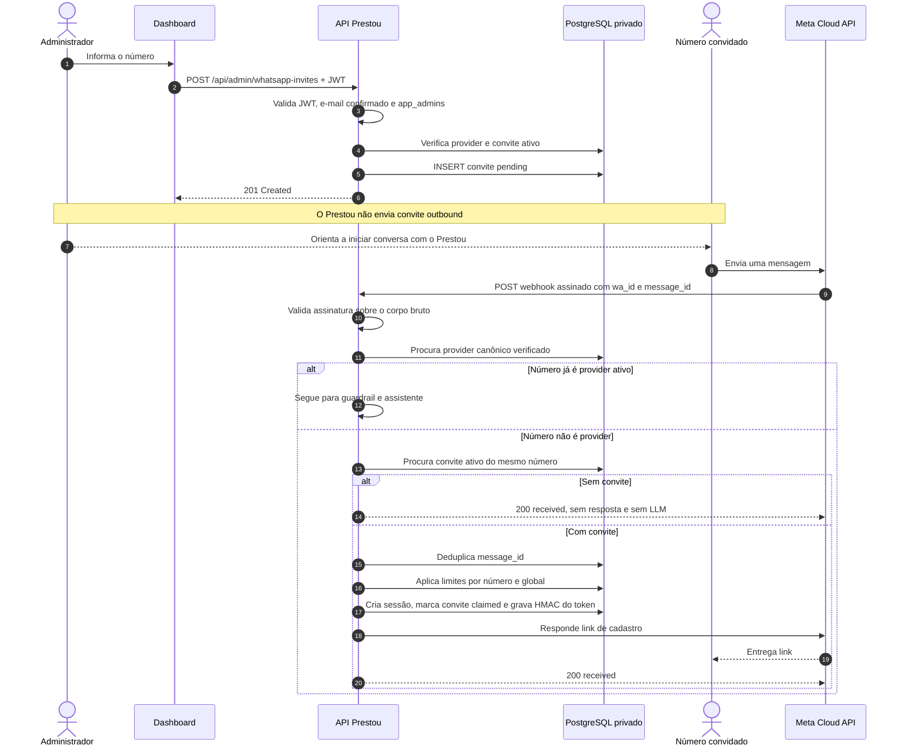
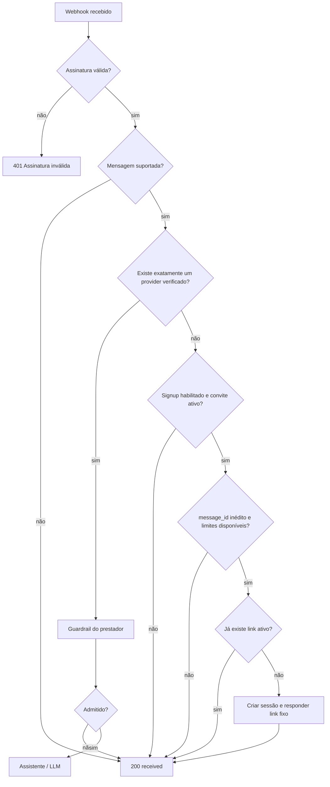
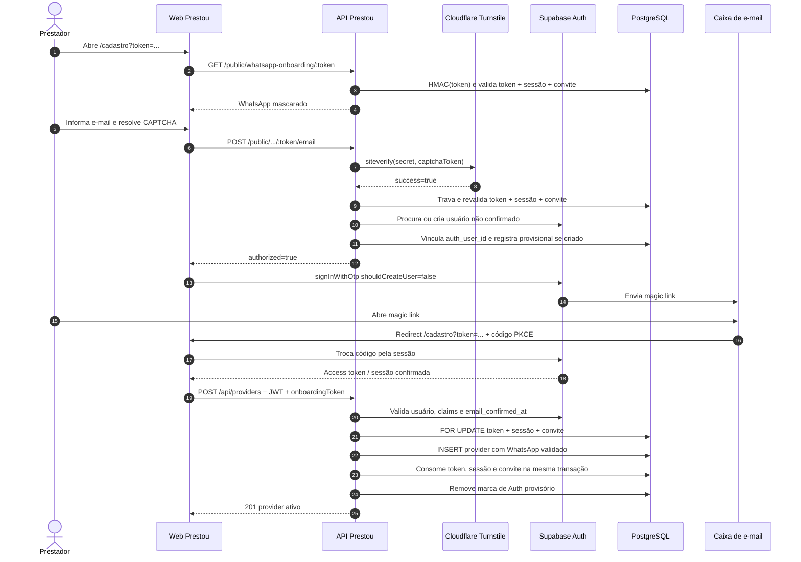
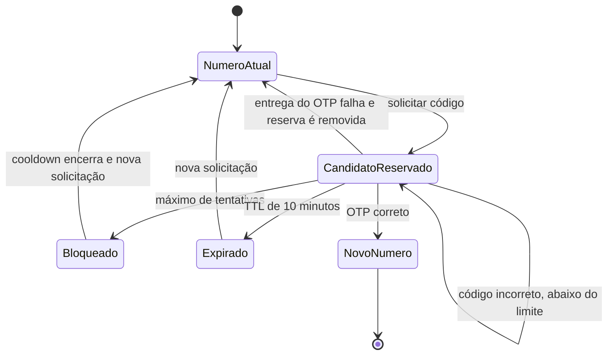
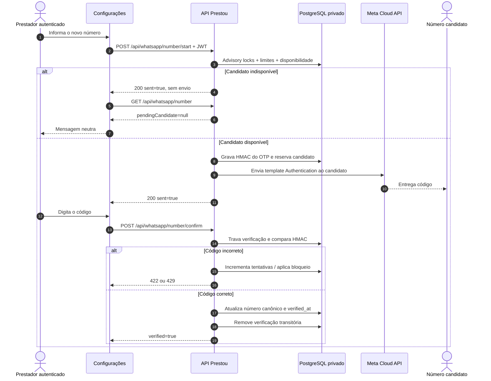

# Fluxo de cadastro, convite e autenticação do prestador

## Objetivo

Este documento descreve o fluxo implementado para:

1. um administrador convidar um número de WhatsApp;
2. o próprio número comprovar sua posse conversando com o WhatsApp do Prestou;
3. o prestador criar e confirmar sua identidade web por magic link;
4. a API criar o `provider` com o WhatsApp já validado;
5. um prestador autenticado trocar posteriormente seu número por OTP.

O cadastro é **WhatsApp-first, web-confirm**: o WhatsApp prova o canal e entrega
o link, enquanto o e-mail continua sendo a identidade recuperável do dashboard.

## Invariantes

- Cada prestador possui exatamente **um** WhatsApp canônico em
  `providers.whatsapp`.
- O número canônico é nacional, com 11 dígitos (`DDD + 9 + número`), sem `+55`.
- `providers.whatsapp` é globalmente único.
- Todo `provider` nasce com `whatsapp_verified_at` preenchido.
- Convite **autoriza** o cadastro, mas não prova o número.
- O inbound assinado da Meta e o `wa_id` **provam o número**.
- O token do link autoriza uma sessão temporária; ele não substitui o login.
- O e-mail confirmado e o JWT Supabase autenticam o dashboard.
- Número desconhecido ou pendente nunca passa pela LLM.
- Troca de número não altera o número atual antes da confirmação do OTP.
- Não existe segundo número ativo por prestador. O candidato de uma troca é
  somente estado transitório no schema `private`.

## Visão geral das provas

| Sinal | O que prova | O que não prova |
| --- | --- | --- |
| Assinatura `X-Hub-Signature-256` | O POST veio da Meta sem alteração | Quem é o prestador |
| `wa_id` do inbound | Posse da conta de WhatsApp remetente | Identidade civil ou autorização para cadastrar |
| Convite ativo | O Prestou autorizou aquele número no piloto | Posse do número |
| Token do link | Acesso temporário ao link enviado na conversa | Autenticação permanente |
| Turnstile | O gate anti-automação foi superado | Posse do telefone ou e-mail |
| Magic link | Controle do e-mail informado | Posse do WhatsApp |
| JWT Supabase | Sessão web autenticada e e-mail confirmado | Autorização administrativa |
| `private.app_admins` | Permissão para administrar convites | Propriedade de qualquer convite específico |

## Fronteiras de confiança



O navegador nunca recebe `SUPABASE_SERVICE_ROLE_KEY`,
`WHATSAPP_ONBOARDING_SECRET`, `WHATSAPP_VERIFICATION_SECRET` ou
`WHATSAPP_APP_SECRET`.

## Estados do cadastro



Estados persistidos do convite:

| Estado | Significado |
| --- | --- |
| `pending` | Convite criado, aguardando inbound do mesmo número |
| `claimed` | O número falou com o Prestou e a sessão foi criada |
| `consumed` | O `provider` foi criado na mesma transação que consumiu o convite |
| `revoked` | Convite cancelado ou expirado por manutenção oportunista |

`expires_at` é sempre autoritativo. Mesmo antes de o status ser atualizado para
`revoked`, um convite expirado não pode ser reivindicado.

# 1. Fluxo de convite

## 1.1 Autorização do administrador

O administrador precisa:

1. possuir sessão Supabase válida;
2. possuir e-mail confirmado;
3. existir em `private.app_admins` pelo `auth.users.id`.

A autorização não usa `user_metadata`, pois esse metadado é editável pelo
usuário. A migração inclui `tiago@tiagopaiva.me` em `private.app_admins`,
resolvendo o `auth_user_id` pelo `provider` e pelo Supabase Auth.

## 1.2 Criação

Endpoint:

```http
POST /api/admin/whatsapp-invites
Authorization: Bearer <JWT>
Content-Type: application/json

{
  "phone": "11999999999",
  "expiresInDays": 7
}
```

Regras:

- `phone` precisa ser celular brasileiro válido e é normalizado para 11 dígitos;
- a expiração aceita de 1 a 30 dias;
- não cria convite para número que já pertence a um `provider`;
- existe no máximo um convite `pending` ou `claimed` por número;
- convite expirado anterior do mesmo número é revogado antes da nova inserção;
- `created_by` recebe o `auth.users.id` do administrador.

O convite é uma **allowlist**. Criá-lo não envia mensagem outbound. O
administrador deve orientar o convidado a conversar com o WhatsApp do Prestou.

## 1.3 Administração

| Operação | Endpoint |
| --- | --- |
| Listar os 100 convites mais recentes | `GET /api/admin/whatsapp-invites` |
| Criar | `POST /api/admin/whatsapp-invites` |
| Revogar | `POST /api/admin/whatsapp-invites/:id/revoke` |

Revogar um convite `pending` ou `claimed` também remove sua sessão de onboarding
não consumida. Os tokens são removidos por `ON DELETE CASCADE`.

## 1.4 Sequência do convite até o link



# 2. Inbound e emissão do link

## 2.1 Validação do webhook

Endpoint público:

```http
POST /api/whatsapp/webhook
X-Hub-Signature-256: sha256=<assinatura>
```

A assinatura é calculada sobre os bytes crus do body. Header ausente, segredo
ausente ou assinatura incorreta retorna `401` antes de qualquer lookup,
persistência, resposta ou LLM.

O handshake da Meta usa:

```http
GET /api/whatsapp/webhook
  ?hub.mode=subscribe
  &hub.verify_token=<WHATSAPP_VERIFY_TOKEN>
  &hub.challenge=<valor>
```

## 2.2 Decisão antes da LLM



Essa separação garante que um número desconhecido não consuma tokens de OpenAI,
não gere conta e não receba resposta sem convite.

## 2.3 Normalização do número

A Meta entrega o remetente com código do país. A API:

1. remove caracteres não numéricos;
2. considera as formas brasileiras com e sem o nono dígito para resolver a
   identidade entregue pela Meta;
3. remove o prefixo `55` para consultar o formato canônico nacional;
4. persiste apenas o formato de 11 dígitos com nono dígito.

## 2.4 Deduplicação e limites

- `message_id` da Meta é único em `private.whatsapp_onboarding_messages`;
- replay do mesmo `message_id` não produz outra resposta;
- limite padrão por número convidado: 3 tentativas por dia;
- limite global padrão: 50 tentativas por dia;
- um número que já excedeu seu limite não continua consumindo o limite global;
- enquanto existir token ativo, novas mensagens ficam silenciosas;
- uma falha ao entregar o link pela Meta invalida o token recém-criado, para uma
  mensagem futura poder gerar outro.

## 2.5 Token do link

O token é uma credencial opaca, não um JWT:

1. a API gera 32 bytes aleatórios;
2. codifica em `base64url`, produzindo 43 caracteres;
3. envia o valor bruto somente no link;
4. calcula `HMAC-SHA-256(WHATSAPP_ONBOARDING_SECRET, token)`;
5. grava apenas o digest em `private.whatsapp_onboarding_tokens`.

Exemplo de link:

```text
https://app.prestou.com/cadastro?token=<43-caracteres-base64url>
```

Valores padrão:

| Elemento | TTL |
| --- | --- |
| Sessão de onboarding | 1.440 minutos (24 horas) |
| Link/token | 15 minutos |

Existe no máximo um token não consumido por sessão. Um token expirado é marcado
como consumido antes da reemissão.

# 3. Autenticação web e criação do prestador

## 3.1 Abertura do link

O navegador consulta:

```http
GET /public/whatsapp-onboarding/:token
```

Se token, sessão e convite continuam ativos, a API retorna somente o telefone
mascarado. O número real não é aceito novamente do navegador.

## 3.2 CAPTCHA e autorização do e-mail

O formulário coleta e-mail e Turnstile. Depois envia:

```http
POST /public/whatsapp-onboarding/:token/email
Content-Type: application/json

{
  "email": "prestador@exemplo.com",
  "captchaToken": "<token-turnstile>"
}
```

Ordem obrigatória:

1. validar formato do token e existência do onboarding;
2. validar o Turnstile server-side com `TURNSTILE_SECRET_KEY`;
3. revalidar e travar token, sessão e convite depois do CAPTCHA;
4. impedir que a sessão troque para outro e-mail;
5. aplicar cooldown padrão de 60 segundos;
6. rejeitar de forma genérica e-mail que já possui `provider`;
7. localizar ou criar o `auth.users` server-side;
8. vincular o `auth_user_id` à sessão em transação.

Em desenvolvimento, sem chaves Turnstile, o token especial `development` é
aceito. Em produção não há bypass implementado: se signup estiver habilitado,
`TURNSTILE_SECRET_KEY` é obrigatório no startup e o frontend precisa de
`VITE_TURNSTILE_SITE_KEY`.

## 3.3 Preparação segura do Supabase Auth

A API usa a service role exclusivamente no servidor:

- se o e-mail já existe sem `provider`, reutiliza o `auth.users.id`;
- se não existe, cria `auth.users` com `email_confirm: false`;
- marca somente usuários criados pelo onboarding em
  `private.whatsapp_onboarding_auth_users`;
- se o vínculo falha, tenta apagar imediatamente o usuário recém-criado;
- nunca apaga uma identidade preexistente;
- se houver dúvida sobre um commit concorrente, preserva um Auth já vinculado a
  qualquer sessão ou `provider`.

Existe no máximo uma sessão ativa por `auth_user_id`.

## 3.4 Envio e confirmação do magic link

Depois de a API autorizar o e-mail, o navegador chama:

```ts
supabase.auth.signInWithOtp({
  email,
  options: {
    emailRedirectTo: `${origin}/cadastro?token=${onboardingToken}`,
    shouldCreateUser: false,
  },
});
```

`shouldCreateUser: false` é uma barreira essencial: o navegador não consegue
criar identidades fora do gate convite + inbound + CAPTCHA.

O Supabase confirma o e-mail quando o usuário abre o magic link e estabelece a
sessão PKCE no navegador. A API valida o access token com Supabase e exige
`email_confirmed_at` antes de permitir a criação do `provider`.

## 3.5 Sequência completa de autenticação



## 3.6 Criação atômica do `provider`

Endpoint:

```http
POST /api/providers
Authorization: Bearer <JWT Supabase>
Content-Type: application/json

{
  "name": "Maria Prestadora",
  "profession": "Eletricista",
  "onboardingToken": "<token>",
  "pixKey": "maria@exemplo.com",
  "consent": true
}
```

O corpo não aceita `whatsapp`. O número vem exclusivamente da sessão criada
pelo inbound.

Na mesma transação PostgreSQL, a API:

1. trava token, sessão e convite com `FOR UPDATE`;
2. confirma que o token não expirou nem foi consumido;
3. confirma que sessão e convite continuam ativos;
4. confirma que `session.auth_user_id` é o usuário do JWT;
5. confirma que `session.phone = invite.phone`;
6. insere `providers.whatsapp` e `whatsapp_verified_at`;
7. marca token e sessão como consumidos;
8. muda o convite para `consumed`;
9. remove o usuário da lista de Auth provisórios.

O índice único de `providers.auth_user_id` impede duas contas para o mesmo
login. O índice único de `providers.whatsapp` impede duas contas para o mesmo
número. Em uma corrida, no máximo uma transação vence.

## 3.7 Login posterior

Depois do cadastro, o login normal continua por e-mail:

```ts
supabase.auth.signInWithOtp({
  email,
  options: {
    emailRedirectTo: `${origin}/`,
    shouldCreateUser: false,
  },
});
```

Um e-mail desconhecido não cria `auth.users`. O Supabase pode responder de
forma neutra para evitar enumeração, mas nenhuma conta é criada.

# 4. Troca posterior do WhatsApp por OTP

O OTP não participa do cadastro inicial. O número inicial já foi provado pelo
inbound da Meta. O OTP existe apenas para um prestador autenticado substituir o
número canônico nas Configurações.

## 4.1 Estado da troca



Durante todos os estados transitórios, `providers.whatsapp` continua sendo o
número anterior e validado.

## 4.2 Solicitação do OTP

Endpoint autenticado:

```http
POST /api/whatsapp/number/start
Authorization: Bearer <JWT>
Content-Type: application/json

{
  "phone": "11988887777"
}
```

Passos:

1. validar e normalizar o candidato;
2. gerar seis dígitos com gerador criptográfico;
3. calcular `HMAC-SHA-256(WHATSAPP_VERIFICATION_SECRET, code)`;
4. adquirir advisory lock por `provider_id` e pelo candidato;
5. contar limites diários de prestador e global;
6. verificar se o candidato já pertence ou está reservado para outra conta;
7. aplicar cooldown de reenvio;
8. contar limite diário do candidato;
9. reservar o candidato em `private.whatsapp_verifications`;
10. enviar o OTP ao **número candidato**, nunca ao número atual.

O código em claro não é persistido em `notifications.body` nem no banco. Ele é
enviado somente como parâmetro do template de autenticação.

Se o número estiver ocupado, a API responde `{ "sent": true }` sem enviar OTP,
evitando enumeração de contas. A UI recarrega o estado autoritativo e mostra uma
mensagem neutra quando não existe candidato reservado.

## 4.3 Template da Meta

No modo `cloud-api`, a troca exige:

```env
WHATSAPP_AUTH_TEMPLATE=prestou_codigo_verificacao
WHATSAPP_TEMPLATE_LANG=pt_BR
```

O template deve ser criado em uma WABA real:

- nome: `prestou_codigo_verificacao`;
- categoria: **Authentication**;
- idioma: Português do Brasil (`pt_BR`);
- um parâmetro de corpo para o OTP;
- botão de copiar código compatível com o parâmetro enviado.

O cadastro iniciado por inbound não usa template: a mensagem com o link é uma
resposta livre dentro da janela de atendimento aberta pelo usuário.

## 4.4 Confirmação

```http
POST /api/whatsapp/number/confirm
Authorization: Bearer <JWT>
Content-Type: application/json

{
  "code": "123456"
}
```

A confirmação:

1. trava a verificação do prestador com `FOR UPDATE`;
2. rejeita ausência, bloqueio ou expiração;
3. compara os HMACs em tempo constante;
4. incrementa tentativas em caso de erro;
5. ao atingir o máximo, apaga o digest válido e aplica cooldown;
6. em sucesso, atualiza `providers.whatsapp` e
   `providers.whatsapp_verified_at`;
7. remove a verificação transitória.

O índice único de `providers.whatsapp` continua sendo o árbitro final. Se outra
conta assumir o número antes da confirmação, a promoção retorna `409`.

## 4.5 Sequência do OTP



# 5. Persistência

## 5.1 Dados permanentes

| Tabela/coluna | Responsabilidade |
| --- | --- |
| `public.providers.auth_user_id` | Liga o prestador ao Supabase Auth; único |
| `public.providers.email` | E-mail confirmado usado no dashboard |
| `public.providers.whatsapp` | Único número canônico; globalmente único |
| `public.providers.whatsapp_verified_at` | Momento da prova por inbound ou OTP; obrigatório |
| `private.app_admins` | Allowlist server-side de administradores |

## 5.2 Dados transitórios

| Tabela | Responsabilidade |
| --- | --- |
| `private.whatsapp_signup_invites` | Autorização do número no piloto |
| `private.whatsapp_onboarding_sessions` | Número provado, e-mail/Auth vinculado e TTL |
| `private.whatsapp_onboarding_tokens` | HMAC do token, expiração e consumo |
| `private.whatsapp_onboarding_messages` | Deduplicação pelo `message_id` da Meta |
| `private.whatsapp_onboarding_counters` | Limites por número e global |
| `private.whatsapp_onboarding_auth_users` | Somente identidades Auth criadas provisoriamente |
| `private.whatsapp_verifications` | Candidato, HMAC do OTP, tentativas e cooldown |
| `private.whatsapp_verification_sends` | Limites OTP por prestador, candidato e global |

Todas as tabelas transitórias ficam no schema `private`, têm RLS habilitada e
permissões revogadas de `PUBLIC`, `anon` e `authenticated`. O navegador não as
acessa pela Data API.

# 6. Retenção e compensação

## 6.1 Compensação imediata

Se a API criou um `auth.users`, mas não conseguiu vinculá-lo à sessão:

1. verifica se o usuário ficou associado a qualquer sessão ou `provider`;
2. se não ficou associado, chama `admin.deleteUser`;
3. se ficou associado por um commit concorrente, preserva a identidade.

## 6.2 Retenção periódica

Endpoint protegido por `CRON_SECRET`:

```http
POST /api/internal/run-whatsapp-onboarding-retention
Authorization: Bearer <CRON_SECRET>
```

A retenção:

- seleciona somente IDs registrados em
  `private.whatsapp_onboarding_auth_users`;
- nunca apaga usuário Auth preexistente;
- não apaga usuário que já possui `provider`;
- não apaga usuário ligado a sessão ainda ativa;
- remove usuários provisórios abandonados depois da janela configurada;
- remove sessões expiradas e sessões consumidas antigas.

Em desenvolvimento, o servidor executa a retenção de hora em hora. Em produção,
um scheduler externo precisa chamar o endpoint.

# 7. Matriz de respostas e falhas

## 7.1 Cadastro e convite

| Situação | Resposta/comportamento |
| --- | --- |
| Webhook sem assinatura válida | `401` |
| Payload válido sem mensagem suportada | `200 received`, silêncio |
| Número desconhecido sem convite | `200 received`, zero onboarding e zero LLM |
| Replay do mesmo `message_id` | `200 received`, sem nova resposta |
| Nova mensagem com link ainda ativo | `200 received`, silêncio |
| Limite por número/global atingido | `200 received`, silêncio |
| Entrega do link falha | Token invalidado; webhook ainda confirmado best-effort |
| Token inválido/expirado no status público | `404` |
| CAPTCHA inválido | `400` |
| Reenvio de magic link dentro do cooldown | `429` |
| Convite vinculado a outro e-mail | `409` genérico |
| E-mail já possui provider | `409` genérico, sem consumir o convite |
| Token consumido ou corrida perdida na criação | `409` |
| Duas finalizações concorrentes | Uma cria; a outra recebe conflito |

## 7.2 Troca por OTP

| Situação | Resposta/comportamento |
| --- | --- |
| Telefone inválido | `400` |
| Template ausente em `cloud-api` | `500`, troca indisponível |
| Número ocupado/reservado | `200 sent=true`, mas sem envio |
| Cooldown ou limite atingido | `429` |
| Meta não entrega o OTP | `502` e reserva removida |
| Nenhuma verificação pendente | `404` |
| Código expirado | `410` |
| Código incorreto | `422` |
| Tentativas esgotadas | Próxima confirmação recebe `429` durante o cooldown |
| Número tomado durante a corrida | `409` |

# 8. Configuração

## 8.1 API

```env
NODE_ENV=production
PUBLIC_WEB_URL=https://app.prestou.com

WHATSAPP_MODE=cloud-api
WHATSAPP_PHONE_NUMBER_ID=<phone-number-id-real>
WHATSAPP_ACCESS_TOKEN=<token-permanente>
WHATSAPP_TEMPLATE_LANG=pt_BR
WHATSAPP_VERIFY_TOKEN=<segredo-do-handshake>
WHATSAPP_APP_SECRET=<app-secret-meta>

WHATSAPP_SIGNUP_ENABLED=true
WHATSAPP_ONBOARDING_SECRET=<32-bytes-aleatorios>
TURNSTILE_SECRET_KEY=<turnstile-secret>

WHATSAPP_AUTH_TEMPLATE=prestou_codigo_verificacao
WHATSAPP_VERIFICATION_SECRET=<32-bytes-aleatorios>

CRON_SECRET=<32-bytes-aleatorios>
```

Os segredos podem ser gerados com:

```bash
openssl rand -hex 32
```

### Função dos segredos

| Variável | Protege | Observação operacional |
| --- | --- | --- |
| `WHATSAPP_APP_SECRET` | Autenticidade dos webhooks da Meta | É fornecido pela Meta e valida `X-Hub-Signature-256`; não deve ser inventado localmente |
| `WHATSAPP_ONBOARDING_SECRET` | HMAC dos tokens do link de cadastro | Deve ser aleatório, estável entre deploys e diferente dos demais segredos |
| `WHATSAPP_VERIFICATION_SECRET` | HMAC dos códigos OTP | Recomenda-se um segredo dedicado; se estiver ausente, a implementação atual deriva do `SUPABASE_SERVICE_ROLE_KEY` |
| `CRON_SECRET` | Endpoints internos de retenção e rotinas agendadas | O scheduler envia `Authorization: Bearer <CRON_SECRET>`; não participa da assinatura do webhook nem dos tokens |
| `WHATSAPP_VERIFY_TOKEN` | Handshake `GET` de configuração do webhook | É um valor escolhido pelo Prestou e cadastrado também no painel da Meta |

Trocar `WHATSAPP_ONBOARDING_SECRET` invalida todos os links de cadastro ainda
ativos. Trocar `WHATSAPP_VERIFICATION_SECRET` invalida os OTPs ainda pendentes.
Essas rotações devem ser planejadas; os valores precisam permanecer iguais em
todas as réplicas da API durante a janela de validade das credenciais.

## 8.2 Frontend

```env
VITE_API_URL=https://api.prestou.com
VITE_SUPABASE_URL=https://<project-ref>.supabase.co
VITE_SUPABASE_ANON_KEY=<publishable-ou-anon-key>
VITE_TURNSTILE_SITE_KEY=<turnstile-site-key>
```

Nenhum segredo server-side pode usar prefixo `VITE_`.

## 8.3 Valores padrão configuráveis

| Variável | Padrão | Função |
| --- | ---: | --- |
| `WHATSAPP_ONBOARDING_SESSION_TTL_MINUTES` | `1440` | Vida da sessão de cadastro |
| `WHATSAPP_ONBOARDING_LINK_TTL_MINUTES` | `15` | Vida do link |
| `WHATSAPP_SIGNUP_GLOBAL_DAILY_LIMIT` | `50` | Tentativas globais de emissão |
| `WHATSAPP_SIGNUP_PHONE_DAILY_LIMIT` | `3` | Tentativas por número convidado |
| `WHATSAPP_SIGNUP_EMAIL_COOLDOWN_SECONDS` | `60` | Intervalo entre magic links |
| `WHATSAPP_VERIFICATION_TTL_MINUTES` | `10` | Vida do OTP |
| `WHATSAPP_VERIFICATION_RESEND_SECONDS` | `60` | Cooldown de reenvio do OTP |
| `WHATSAPP_VERIFICATION_MAX_ATTEMPTS` | `5` | Máximo de tentativas do código |
| `WHATSAPP_ABUSE_COOLDOWN_MINUTES` | `30` | Bloqueio após esgotar tentativas do OTP; hoje é compartilhado com o guardrail |
| `WHATSAPP_VERIFICATION_PROVIDER_DAILY` | `5` | Solicitações por prestador/dia |
| `WHATSAPP_VERIFICATION_CANDIDATE_DAILY` | `5` | Envios para candidato/dia |
| `WHATSAPP_VERIFICATION_GLOBAL_DAILY` | `1000` | Envios OTP globais/dia |

## 8.4 Supabase hospedado

Além do arquivo local `supabase/config.toml`, o projeto hospedado precisa ser
configurado no Dashboard:

- signup público desabilitado;
- Site URL do frontend de produção;
- redirect URL do frontend;
- redirect URL `/cadastro` usada pelo magic link do convite;
- SMTP adequado ao volume do piloto;
- JWT e sessões com política compatível com o risco do produto.

Editar somente `supabase/config.toml` não altera automaticamente o projeto
hospedado.

## 8.5 Validação de startup atual

Com `NODE_ENV=production`, a API atual exige:

- `WHATSAPP_MODE=cloud-api`;
- `WHATSAPP_PHONE_NUMBER_ID` e `WHATSAPP_ACCESS_TOKEN`;
- `WHATSAPP_VERIFY_TOKEN` e `WHATSAPP_APP_SECRET`;
- `WHATSAPP_AUTH_TEMPLATE`;
- `TURNSTILE_SECRET_KEY` quando `WHATSAPP_SIGNUP_ENABLED=true`.

Embora o cadastro por inbound não use template, a implementação atual exige
`WHATSAPP_AUTH_TEMPLATE` no startup para manter a troca de número disponível.

# 9. Checklist de aceite

## Convite e inbound

- [ ] Somente administrador confirmado cria, lista ou revoga convites.
- [ ] Convite não envia mensagem outbound.
- [ ] Convite sozinho não marca o telefone como validado.
- [ ] Webhook inválido é rejeitado antes de qualquer ação.
- [ ] Número sem convite fica silencioso e não passa pela LLM.
- [ ] Mesmo `message_id` não produz dois links.
- [ ] Nova mensagem não gira um link ainda ativo.

## Autenticação e cadastro

- [ ] Turnstile é validado no servidor antes do Supabase Auth.
- [ ] Login e onboarding usam `shouldCreateUser: false` no navegador.
- [ ] `provider` só é criado para e-mail confirmado.
- [ ] Telefone enviado pelo navegador é rejeitado.
- [ ] Telefone vem da sessão provada pelo inbound.
- [ ] Token, sessão e convite são consumidos na transação do `provider`.
- [ ] Corridas criam no máximo uma conta por número e por identidade Auth.
- [ ] Usuário Auth provisório abandonado é removido pela retenção.
- [ ] Usuário Auth preexistente nunca é removido pela retenção.

## OTP

- [ ] Código é enviado ao candidato, não ao número atual.
- [ ] Código em claro não aparece no banco nem nos logs.
- [ ] Candidato ocupado não é revelado externamente.
- [ ] Reenvio, tentativas e volume possuem limites atômicos.
- [ ] Número atual permanece válido até o OTP correto.
- [ ] Promoção final respeita a unicidade global.

# 10. Referências de implementação

- `apps/api/src/whatsapp-onboarding.ts`
- `apps/api/src/routes/whatsapp.ts`
- `apps/api/src/routes/providers.ts`
- `apps/api/src/auth.ts`
- `apps/web/src/auth.tsx`
- `apps/web/src/pages/Login.tsx`
- `apps/web/src/pages/Onboarding.tsx`
- `apps/web/src/pages/Settings.tsx`
- `supabase/migrations/20260724120000_whatsapp_number_unification.sql`
- `supabase/config.toml`
