# Spec: Onboarding self-serve pelo WhatsApp

## Objective

Construir uma porta de entrada pública para que um prestador conheça o Prestou,
inicie o cadastro pelo próprio WhatsApp e crie sua conta sem convite ou ação de
um administrador.

O incremento transforma aquisição assistida em um funil self-serve mensurável,
sem trocar o modelo atual de identidade: o WhatsApp prova o número e o e-mail
confirmado continua autenticando o dashboard.

### Usuário

Prestador de serviço autônomo, com WhatsApp brasileiro, que chegou por um canal
de aquisição e ainda não possui conta no Prestou.

### Jornada-alvo

1. O prestador acessa uma URL pública atribuível ou um CTA **Começar pelo
   WhatsApp**.
2. O CTA abre o número oficial do Prestou no WhatsApp com uma mensagem de
   início determinística e pronta para envio.
3. O prestador envia a mensagem. O webhook assinado da Meta prova o número.
4. A API reconhece a intenção pública de cadastro sem usar LLM, aplica os
   limites de abuso e responde com um link temporário de uso único.
5. Na web, o prestador supera o Turnstile, informa e confirma o e-mail por magic
   link e preenche nome, profissão, chave Pix, município opcional e
   consentimento LGPD.
6. A API cria o `provider` atomicamente com o WhatsApp já verificado.
7. O funil registra a origem e as transições até conta criada e primeira
   ativação de produto.

```mermaid
flowchart LR
    TRAFEGO["Canal de aquisição"] --> ENTRADA["URL pública atribuível"]
    ENTRADA --> WA["WhatsApp iniciado pelo usuário"]
    WA --> WEBHOOK["Webhook Meta assinado"]
    WEBHOOK --> GATE["Gate determinístico + antiabuso"]
    GATE --> LINK["Link web temporário"]
    LINK --> EMAIL["Turnstile + e-mail confirmado"]
    EMAIL --> PERFIL["Perfil + Pix + LGPD"]
    PERFIL --> CONTA["Provider ativo"]
```



### Modos operacionais

O onboarding deve suportar três modos configuráveis, sem deploy:

| Modo | Comportamento para número sem conta |
| --- | --- |
| `disabled` | não cria novas sessões; contas ativas continuam operando |
| `invite_only` | preserva exatamente o fluxo assistido atual |
| `public` | aceita convite ativo **ou** intenção pública válida iniciada pelo próprio número |

O modo `public` não remove o fluxo administrativo. Convites continuam úteis
para coortes recrutadas e devem permanecer distinguíveis do tráfego orgânico.

### Histórias e aceite de produto

- Como candidato, consigo sair de um CTA público e concluir uma conta sem
  contato humano do Prestou.
- Como responsável por GTM, consigo atribuir uma conta a origem, campanha e
  mecanismo de entrada (`public` ou `invite`).
- Como operador, consigo fechar a entrada pública imediatamente e retornar a
  `invite_only` sem afetar usuários ativos.
- Como responsável por segurança, sei que um número desconhecido não consome
  LLM, não cria cobrança, não envia mensagem a terceiros e não cria identidade
  Supabase antes dos gates web.
- Como administrador, continuo podendo criar, acompanhar e revogar convites.

### Fora de escopo

- autenticação web por telefone ou migração para Supabase Phone Auth;
- cobrança de assinatura, trial, checkout ou status de pagamento;
- automação de mídia paga, CRM, referral ou campanha de marketing;
- redesign completo do site institucional;
- qualificação do ICP dentro do onboarding;
- coleta de chave Pix em conversa de WhatsApp;
- uso de LLM durante qualquer estado anterior a `provider` ativo.

## Tech Stack

- Node.js 24 e pnpm 11.9;
- TypeScript 5.6+;
- frontend React 19, React Router 7 e Vite 8;
- API Fastify 5 com validação Zod 3;
- Supabase Auth por magic link;
- PostgreSQL/Supabase para estado transacional e eventos;
- Meta WhatsApp Cloud API para webhook e resposta dentro da janela iniciada
  pelo usuário;
- Cloudflare Turnstile antes da preparação da identidade Auth.

Não se prevê nova dependência para o incremento. Qualquer necessidade deve ser
justificada no plano técnico e aprovada antes da implementação.

## Commands

O wrapper `rtk` é obrigatório quando disponível. No ambiente atual ele não está
instalado; nesse caso os comandos abaixo rodam sem o prefixo.

```bash
pnpm install --frozen-lockfile
pnpm dev:api
pnpm dev:web
pnpm --filter @prestou/api test
pnpm --filter @prestou/web test
pnpm typecheck
pnpm build
```

Quando houver migração, a validação deve usar o fluxo Supabase já adotado pelo
repositório antes de `supabase db push` em qualquer ambiente compartilhado.

## Project Structure

```text
apps/api/src/whatsapp-onboarding.ts   máquina de estados e tokens de onboarding
apps/api/src/routes/whatsapp.ts       admissão do inbound antes da LLM
apps/api/src/routes/providers.ts      promoção atômica da sessão para provider
apps/api/src/analytics.ts             eventos e consultas de funil
apps/api/src/config.ts                modo, limites e kill switch
apps/api/test/                         testes unitários e de integração da API
apps/web/src/App.tsx                  rotas públicas e privadas
apps/web/src/pages/Login.tsx          confirmação de e-mail do onboarding
apps/web/src/pages/Onboarding.tsx     perfil, Pix e consentimento
apps/web/src/pages/                    entrada pública mínima do funil
supabase/migrations/                  mudanças aditivas de persistência
docs/whatsapp-operacao.md             configuração, rollout e runbook
specs/                                especificações e decisões
tasks/plan.md                          plano técnico após aprovação desta spec
tasks/todo.md                          tarefas após aprovação do plano
```

## Code Style

Seguir o estilo existente: TypeScript estrito, nomes explícitos em inglês no
código, texto de interface em português, Zod na fronteira e retornos precoces
para negar capacidade antes de efeitos externos.

```ts
const publicSignupIntentSchema = z.object({
  campaignToken: z.string().max(128).optional(),
  intent: z.literal("signup:start"),
}).strict();

if (config.whatsapp.signup.mode !== "public") return undefined;
if (!publicSignupIntentSchema.safeParse(candidate).success) return undefined;
```

Convenções:

- indentação de 2 espaços e aspas duplas;
- funções e variáveis em `camelCase`, tipos em `PascalCase`;
- SQL parametrizado; nunca interpolar entrada externa;
- erros públicos genéricos quando uma resposta específica permitir enumeração;
- comentários explicam invariantes e fronteiras de confiança, não a sintaxe.

## Testing Strategy

### API

Usar o runner nativo de Node nos testes de `apps/api/test/`. Cobrir a máquina de
estados e as fronteiras externas com integrações simuladas da Meta, Turnstile e
Supabase Auth.

Casos mínimos:

- `public`: número novo + intenção válida recebe um único link;
- `invite_only`: o mesmo número sem convite continua silencioso;
- `disabled`: nenhuma sessão nova é criada;
- convite existente continua funcionando nos modos permitidos;
- mensagem desconhecida que não representa intenção de cadastro não cria
  sessão e não chega à LLM;
- número já vinculado não cria segunda conta;
- replay de `message_id`, concorrência e reenvio não criam dois tokens nem duas
  contas;
- limites por número e globais são atômicos e falham fechados;
- token bruto, conteúdo sensível e e-mail não aparecem em logs;
- CAPTCHA inválido não cria `auth.users`;
- abandono é limpo pela retenção sem apagar usuário Auth preexistente;
- atribuição sobrevive à transição web → WhatsApp → web e chega à conta criada;
- eventos repetidos são idempotentes.

### Frontend

Usar Vitest e Testing Library junto aos componentes em `apps/web/src/`.

Cobrir:

- CTA público abre o destino oficial com mensagem pronta;
- parâmetros permitidos de atribuição são preservados e dados arbitrários não
  são refletidos na interface;
- estados de link expirado, limite atingido, e-mail enviado e conclusão;
- copy deixa de dizer “somente para convidados” quando o modo público estiver
  ativo;
- navegação por teclado, rótulos, foco e mensagens de erro acessíveis.

### Verificação de fluxo

Antes do rollout, executar um smoke test real em staging com dois números: um
novo e um já ativo. Confirmar no banco e nos logs cada transição, a atribuição e
a ausência de chamadas à LLM durante o onboarding.

Não há meta de cobertura percentual global. Todo ramo novo da máquina de
estados e toda regressão de segurança identificada precisam de teste.

## Boundaries

### Always

- escrever o teste de comportamento antes da implementação correspondente;
- manter a prova do telefone derivada somente do webhook assinado e do `wa_id`;
- aceitar o telefone da sessão, nunca do navegador, ao criar o `provider`;
- armazenar somente digest/HMAC de credenciais temporárias;
- aplicar deduplicação antes de resposta, chamada externa ou escrita derivada;
- manter sessão, token e estado pré-ativação em schema `private` com retenção;
- registrar métricas sem corpo de mensagem, token, chave Pix ou e-mail em claro;
- fazer mudanças de banco por migração aditiva e com caminho de rollback;
- rodar testes, typecheck e build antes de considerar a entrega concluída;
- atualizar esta spec e `docs/whatsapp-operacao.md` quando decisões mudarem.

### Ask first

- trocar e-mail por telefone como identidade do dashboard;
- remover ou degradar o fluxo administrativo de convites;
- adicionar dependências, provedor externo, template da Meta ou CAPTCHA novo;
- coletar nova PII ou incluir identificadores pessoais em analytics;
- alterar CI, infraestrutura de produção ou política de retenção;
- elevar limites de ativação ou liberar o modo `public` em produção.

### Never

- criar `provider` sem telefone provado e e-mail confirmado;
- criar usuário Supabase no primeiro inbound ou antes do CAPTCHA;
- encaminhar número desconhecido ou sessão pendente para a LLM;
- permitir operação financeira, outbound a terceiros ou upload antes da conta
  ativa;
- confiar em telefone, origem, campanha ou estado de autorização enviado pelo
  navegador sem validação;
- registrar token bruto, segredo, chave Pix, CAPTCHA, conteúdo de mensagem ou
  magic link;
- remover teste falhando para liberar rollout;
- habilitar cadastro público sem kill switch, teto global e observabilidade do
  funil.

## Success Criteria

### Funcionais

- Um número brasileiro novo conclui o caminho CTA → WhatsApp → e-mail → perfil
  → `provider` sem convite e sem intervenção administrativa.
- O mesmo artefato implantado alterna entre `disabled`, `invite_only` e
  `public` por configuração validada no startup.
- O fluxo de convite atual continua operacional e distinguível do self-serve.
- Um número já ativo nunca cria outra sessão/conta e recebe orientação
  determinística compatível com usuário existente.
- Links expirados, consumidos ou encaminhados não permitem promover duas contas.

### Segurança e confiabilidade

- Zero chamada de LLM e zero capacidade financeira antes de `provider` ativo.
- Zero criação de `auth.users` antes de Turnstile válido.
- Replay ou corrida resulta em no máximo um token ativo por número e uma conta
  por WhatsApp/identidade Auth.
- Limites por número e global, retenção e kill switch possuem testes
  automatizados e smoke test em staging.
- Logs e eventos não contêm credenciais temporárias ou PII sensível.

### Funil e operação

- Cada sessão guarda `entry_mode` e, quando disponível, uma atribuição de
  campanha validada; ausência de atribuição vira `direct/unknown`, nunca bloqueia
  cadastro legítimo.
- São mensuráveis, por coorte e período: entrada pública aberta, inbound de
  cadastro recebido, link emitido, link aberto, e-mail autorizado, conta criada
  e primeira cobrança criada.
- É possível calcular conversão e abandono entre cada par de etapas sem juntar
  logs manualmente.
- Alertas ou consulta operacional mostram bloqueios por limite, falhas externas
  e volume diário antes de ampliar tráfego.

### Gate de rollout

1. `invite_only` permanece como padrão durante desenvolvimento e staging.
2. Staging passa pelos testes automatizados e pelo smoke test com números reais.
3. Produção inicia em `public` com teto diário baixo e uma única origem/coorte.
4. Após sete dias, aumentar o teto somente se não houver duplicidade, vazamento
   de PII, abuso relevante ou falha de retenção.
5. Qualquer violação de segurança ou custo retorna imediatamente a
   `invite_only`; contas já ativas permanecem funcionando.

## Approved Decisions

Aprovado em 2026-08-06:

1. A porta de entrada é uma URL/CTA público que abre `wa.me` com mensagem pronta;
   não há formulário de telefone nem outbound iniciado pelo Prestou.
2. O e-mail por magic link permanece obrigatório.
3. O primeiro CTA vive em uma rota pública mínima no app; integrações com site
   institucional podem apontar para a mesma URL.
4. A atribuição inicial usa `source`, `medium`, `campaign` e `content`, com
   valores normalizados e limites estritos.
5. O rollout começa com no máximo 20 novas sessões públicas por dia, separado
   dos limites do assistente para contas ativas.
6. “Oi” não inicia cadastro público. Somente a mensagem determinística do CTA
   inicia o fluxo; os demais números desconhecidos ficam silenciosos.
7. Habilitar o modo `public` em produção continua sendo uma ação operacional
   separada e exige confirmação humana no momento do rollout.

## Gate para a próxima fase

Esta spec autoriza a elaboração de `tasks/plan.md`, com dependências, ordem de
migração, slices verticais, riscos e checkpoints. Somente após nova aprovação
será criado `tasks/todo.md` e iniciada a implementação.
